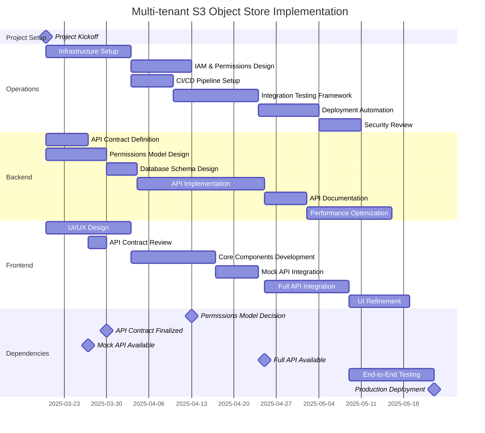
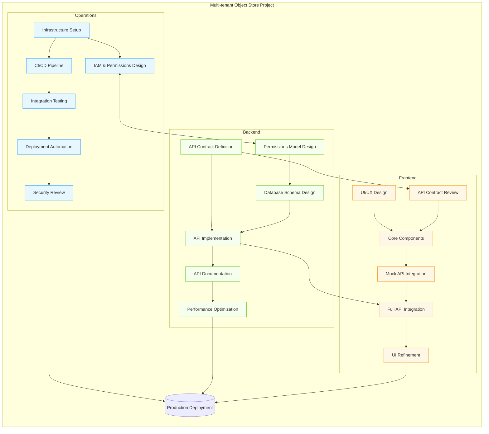

# Implementation Plan

Imagine you will be working alongside 2 Senior software engineers to implement the MVP for this feature, as much in parallel as possible. Divide up the work and make a general implementation plan.

- What pieces of work will be included in each workstream, what can be parallelized, where dependencies will exist
- What work you would select to implement yourself and why

## Work Streams

For three engineers it makes sense to divide the work into three concerns:

1. Operational: Automation, Testing and Delivery
2. Backend: Data and API
3. Frontend: Presentational Layer

### Operational

This application depends critically on third-party cloud provider interfaces, so it's important to have all the cloud provider features lined up and working according to what the application needs. So this workstream focuses on ensuring that the necessary tools are in place to create resources in the cloud provider(s), secure them, correct drift and provide a framework for iterating on the cloud platform itself. Tools like Pulumi, Terraform, and Ansible come to mind.

In addition, this workstream includes building a framework to ensure the application is always in a deliverable state. Every workstream includes writing unit tests, but this workstream builds CI/CD and integration testing tools so that we can be sure that updates to the product meet the contract.

### Backend

The Data and API workstream determines and implements the API and metadata-model.

### Frontend

This workstream involves building user facing interfaces (as opposed to APIs). These could be CLIs or GUIs depending on demand, but I'll assume Web UI for now...

## Dependencies

### Permissions Model: Database or Cloud IAM

If the application is intended to be cross-cloud, then it makes sense to keep as much metadata in the application itself as possible. That is a risk, though, because a small error in the application coding could expose files to the wrong tenant. That is less likely to happen if permissions and user management are handled via the cloud provider's IAM, but that is more complex.

Thus, agreeing upon and implementing the permissions model is a shared responsibility of the Backend and Operational workstreams.

### API Contract

The Frontend is limited until they have a firm API contract; so they will need that from the Backend workstream as early as possible.

### Gantt

### Flowchart

# Assignment

I'd work on the Data and API workstream. It's the central part of the project and can offer flexible support to both the operational and frontend workstreams if necessary.
